# Data-Science-competition-MCFITB-2026
This repository contains the results of the work from the Data Science competition MCFITB 2026. This project is a time series forecasting that includes EDA, preprocessing, feature engineering and modelling.

## Project Background
This project involved data-driven analysis and predictive modeling for an insurance company in Indonesia. Kaggle-based scoring and evaluation of the trained model using metric MAPE(Mean Absolute Percentage Error) were used.

## Problem Understanding
One issue that has emerged in recent years is the increase in individual health insurance claims, which increased by 25.5% between January and June 2025 compared to the same period in 2024. This increase in claims will impact premium adjustments, potentially making individual health insurance premiums less affordable.
Therefore, data-driven analysis is needed to predict the factors that most influence claim values. This allows initiatives such as risk selection, prevention, and early detection to minimize the impact of increased claims and maintain affordable premiums.

## Objective
- Identify the factors that influence the frequency of claims, the severity of claims and the total nominal amount that must be paid by the company.
- Training a machine learning-based model to predict trends in frequency, severity, and total nominal for the period August - December 2025

## Tools
- Python notebook (Google colab)
- Exploritary Data analysis libary (Pandas,  Numpy, Matplotlib, seaborn, statsmodels, scipy)
- Preprocessing library(StandardScaler - scikit learn)
- Forecasting library (sm for SARIMAX model - statsmodels, RandomForestRegressor - scikit learn, lGBM - lightbm)
- Evaluating library (MAPE - scikitlearn)

## Dataset Information
The dataset consists of two files: "Data_Klaim.csv" and "Data_Polis.csv." This data will be processed for analysis and used to train predictive models. The following is information from these two datasets:
- A. Data_Klaim.csv: This data records insurance users who submit claims based on a unique code called a claim ID, which represents each user's policy number. This data focuses more on the claims process, recording data such as the claim amount, claim date, etc.
- B. Data_Polis.csv: This data records personal information about insurance users, such as the policy number, plan code (type of insurance used), date of birth, domicile, and policy registration date.

## Dataset Prepareration
To process the data for analysis and training the predictive model, the two datasets will be combined into a single dataset using the policy number as the foreign key in data_claims.csv and the primary key in the policy data. New features will then be created, such as the claimant's age, treatment duration, and disease category. After this process, the tabular data will be aggregated into weekly timeframes based on the claim date, creating time series data. In line with the project objective, this predicts frequency trends calculated from the number of claim IDs occurring at a specific time. In this case, weekly. The total amount spent by the company is calculated from the number of claims issued by the company within a week. Several other variables will also be aggregated weekly. Below are some of the variables used in the aggregation of tabular data into weekly time series data.

After aggregation, we obtain several variable categories for analysis.
- A. Time variable: time
  - Functional for time series analysis
  - Seasonal decomposition
  - Trend analysis
- B. Target variable: frequency, total_nominal_claim, severity 
  - Target prediction 
  - Trend analysis
- C. Demographic variable: avg_age, pct_male -
  - Analysis of the influence of demographics on the target variable
- D. Health service: mean_los (length of stay), pct_inpatient, pct_cashless
  - Analysis of the influence of health services on the target variable
- E. Hospital cost: mean_biaya_rs, median_biaya_rs
  - Analysis of the influence of hospital costs on the target variable
- D. Disease composition: pct_kanker, pct_genitourinary, pct_mata_telinga
  - Disease driver analysis 
  - Identification of diseases contributing to claim costs
- E. Hospital Location: pct_ind, pct_sg, pct_malay 
  - Comparison of claim costs across countries 
  - Identify the influence on the target variable

## Exploritary Data Analysis 
- A. Plotting target variable
  - Frequency Plot
  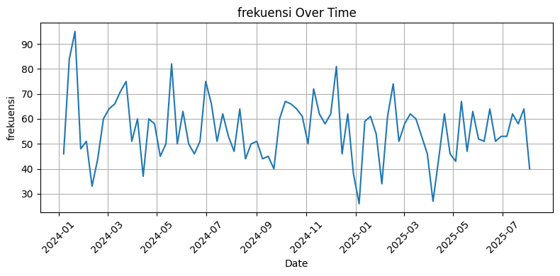
  - Severity Plot
  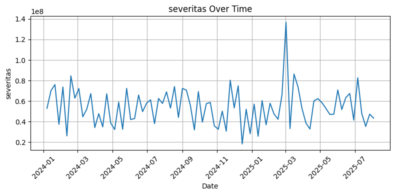
- B. Moving Avarage(SMA & EMA)
  - Frequency Moving Avarage
  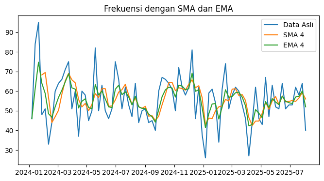
  - Severity Moving Avarage
  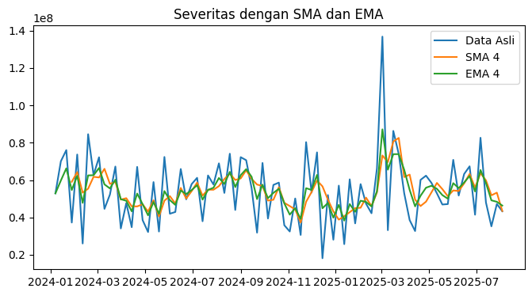
- C. Time Series Analysis
In this section, we analyze the trend and seasonality of the target variable data. The frequency and severity patterns appear quite volatile for the 2024-2025 period. The methods used for trend analysis are Simple Moving Average and Exponential Moving Average, with SMA(4) and EMA(4). This means we use a moving average with a period of 4 weeks, or approximately one month. This method helps smooth out the volatility of the data.
  - Trend Analysis:
    1. Frequency Analysis:
    The frequency values ​​are mostly in the range of 50-70 claims per week. Some spikes in the original data do not significantly change the direction of the SMA and EMA. The frequency trend tends to be stable from 2024 to mid-2025.
    2. Severity Analysis:
    The high spike in early 2025 was likely caused by a large number of claims, but the SMA and EMA lines returned to normal ranges after the spike. The severity trend was relatively stable, but there were several outliers with very high claim values.
  - Seasonal Decomposition Analysis:
    1. Frequency seasonal decomposition
    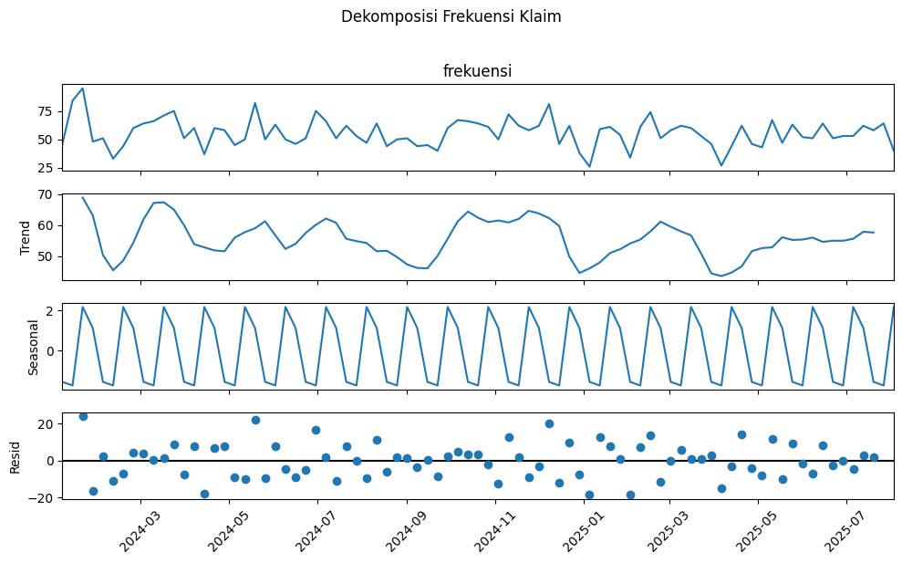
    The analysis reveals a seasonal pattern in claims in week 3, which has consistently peaked over several months. Conversely, week 2 shows a relatively high reflex rate. While there are indications of an upward trend in week 3, the overall strength of the seasonal pattern remains limited due to significant data variability and a relatively stable trend. This seasonal pattern is reinforced by the graph and boxplot below. 
    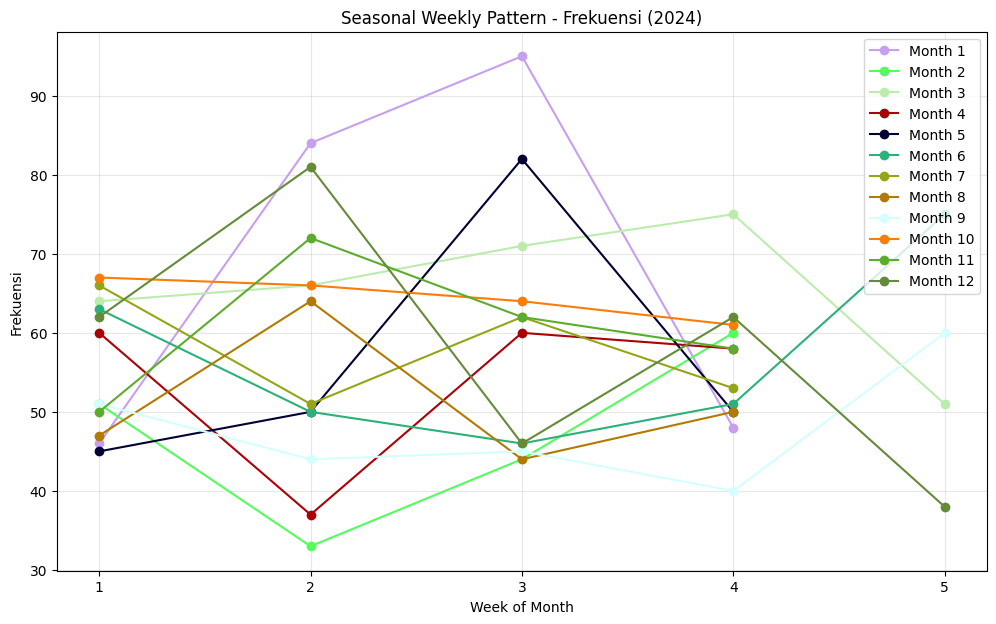
    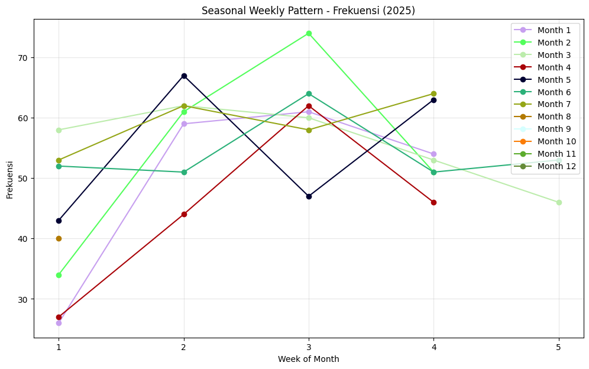
    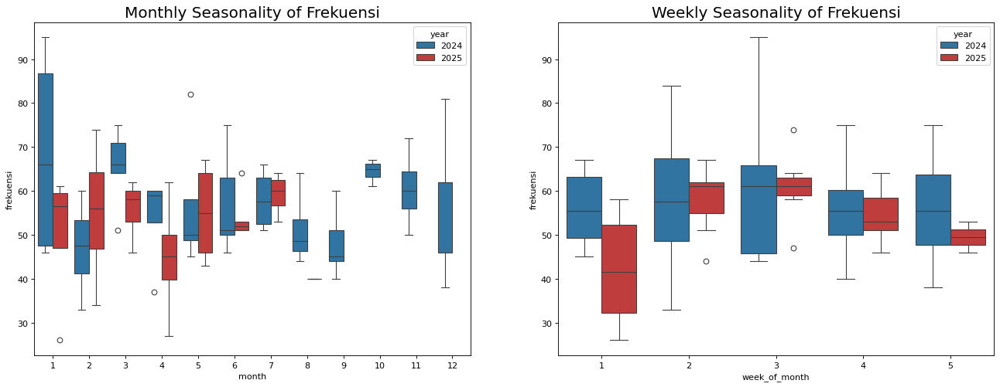
    2. Severity seasonal decomposition
    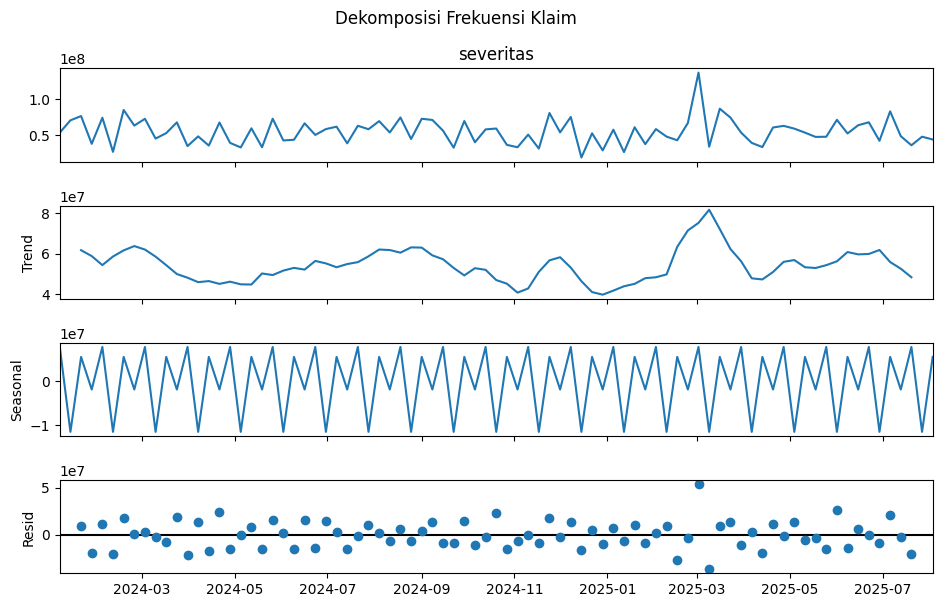
    The analysis indicates that claim severity tends to reach a higher value in week 3, reflecting an increase in claim intensity in the middle of the month. Subsequently, a decline occurs in week 4. This pattern aligns with the seasonal in claim frequency, which also shows an increase in week 3. This is similar to the movement from frequency to likelihood, as frequency is a driver of claim severity.
    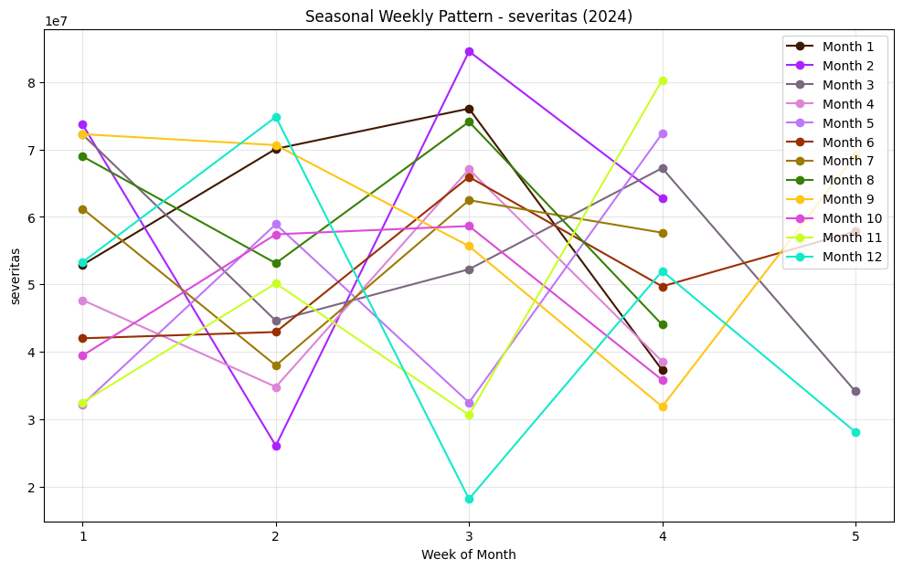
    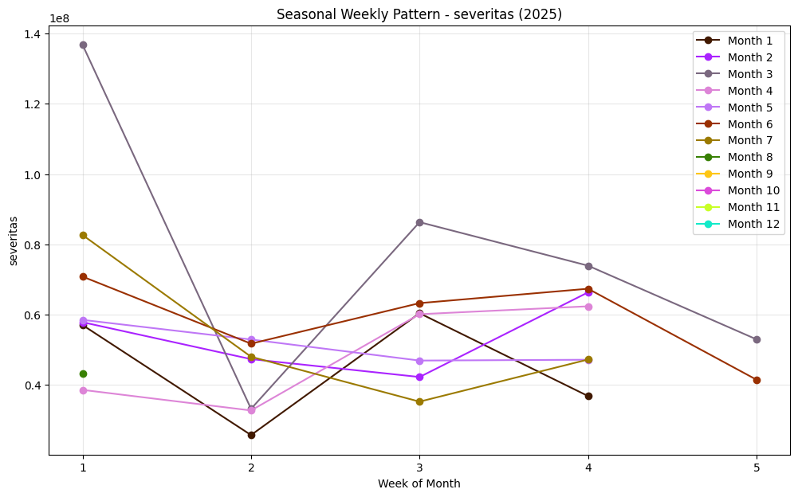
    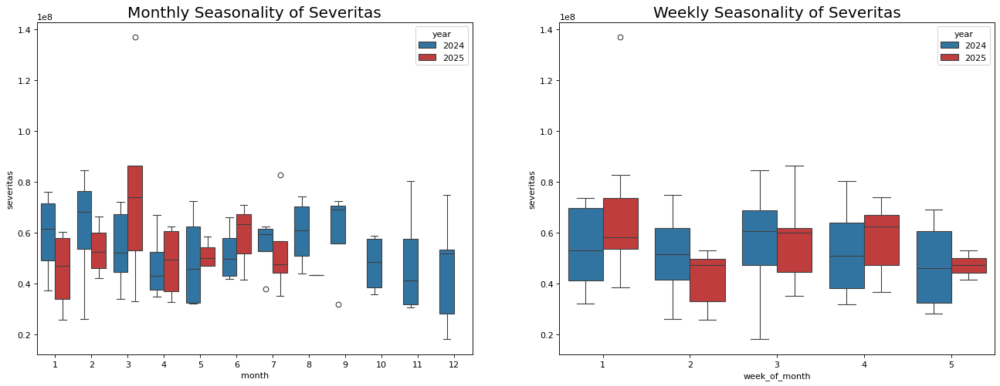

## Stationarity Check 
Based on the results of the Augmented Dickey-Fuller (ADF) test, the ADF statistic obtained a significantly negative value and a p-value close to zero for both variables. This indicates the rejection of the null hypothesis stating the presence of a unit root. Therefore, the data can be categorized as stationary at the level, thus fulfilling the basic assumptions of time series analysis without the need for additional transformations such as differencing.
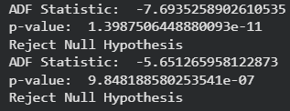

## Autocorrelation (ACF & PACF)
- Frequency ACF and PACF
  
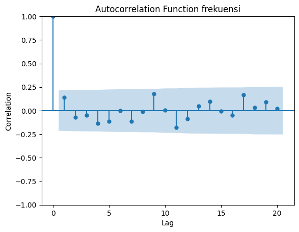
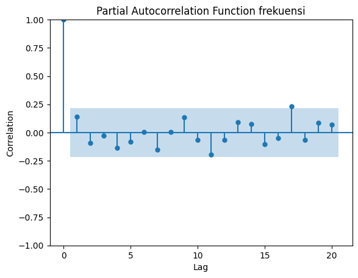
Almost all lags are in the confidence interval except lag 17 on 
This PACF is probably noise, in this case it means past values 
has no correlation with current values

- Severity ACF and PACF
  
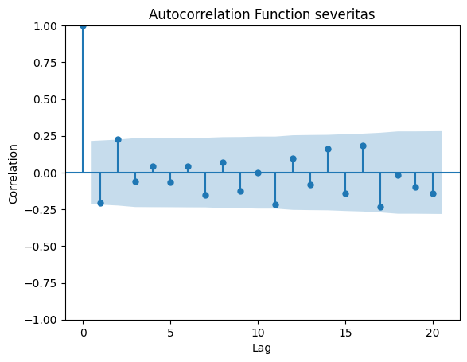
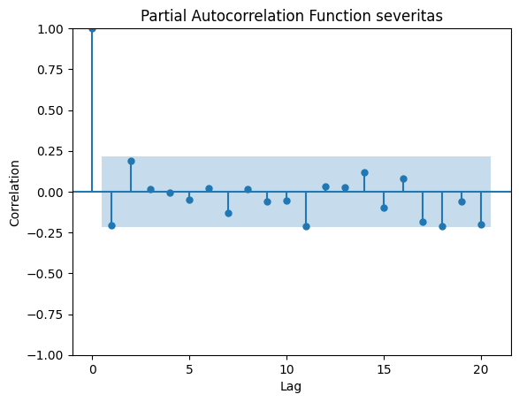
Lags 1 & 2 in ACF and lag 1 in PACF are slightly out of confidence 
interval indicates weak correlation at lags 1 and 2 with the mass value 
Now

The results of autocorrelation using ACF and PACF will be used to adjust the parameters of traditional time series models such as ARIMA or SARIMAX. ACF is used to adjust MA and PACF is used to adjust AR for the model parameters.

## Exogeneous variable analysis 
This section examines whether demographic variables, health services, and hospital costs (exog variables) influence the frequency and severity values. In other words, whether the exog variable series influences the present value.
This test uses the Granger causality method.
- a. Frequency
Based on the results of the Granger Causality test, several variables showed a significant effect on claim frequency, with a p-value <0.05. The week_of_month variable at lag 1 showed a time-of-month pattern on claim frequency, indicating a weekly seasonal pattern in the number of claims. Furthermore, the pct_male variable at lag 1 also had a significant effect, indicating that changes in the proportion of male participants were associated with changes in claim frequency. Another significant variable was pct_genitourinaria at lags 1 and 2, indicating that an increase in the percentage of genitourinary disease claims could influence changes in claim frequency over the next two time periods. This suggests that specific disease types may be a contributing factor to the dynamics of claim frequency.
- b Severity
Based on a p-value < 0.05, only one variable has a significant effect on severity, namely: avg_age (lag 1)
with a p-value ≈ 0.0317.
The average participant age variable has a significant relationship with changes in claim severity. This indicates that changes in average participant age in the previous period can affect the average claim cost in the subsequent period.

## Feature Engineering and Data Preprocessing
In this section, we perform feature engineering and preprocessing for the data we will use to train the model. Here, we perform feature selection from the EDA results for each target, such as the frequency we use for the variables week and pct_genitourinaria. We also create a few temporal features to aid model training, such as 'month', 'week_of_year', and 'quarter', due to their autocorrelation results being within the confidence interval. We also use the frequency we use for the features 'avg_age', 'month', 'week_of_year', and 'quarter'. This data will be used to train a traditional time series model, namely SARIMAX.

Preparing time series data requires a different approach than with conventional data, as conventional machine learning models do not inherently consider time sequences. Therefore, feature engineering is performed by adding lag features, which use values ​​from previous periods as predictors, and rolling features to capture short-term trends.
However, given the relatively low level of autocorrelation, lag selection needs to be limited to avoid introducing noise into the model. In this case, small lags such as lag-1, lag-2, and lag-4 are used, along with a rolling window of 4 periods, to maintain a balance between historical information and model stability.
Meanwhile, classic time series models like SARIMAX intrinsically accommodate lag components and are specifically designed to handle temporal dependencies, eliminating the need for explicit lag feature additions as in common machine learning models.

## Modelling 
The models used in this experiment include SARIMAX with parameters (0,0,0) or AR(0) and MA(0), SARIMAX(0,0,1)AR(0)
MA(1) for frequency and SARIMAX(1,0,1) AR(1) MA(1) for severity, as well as several machine learning models such as Randomforest and LightBM. Exogenous variables are used to aid model prediction.
- Training Result;
  - SARIMAX(0,0,0) (Frequency)
  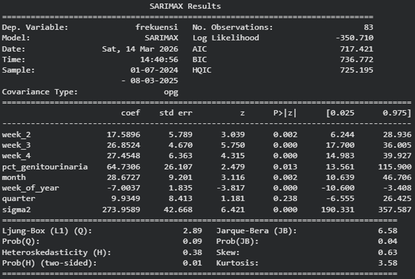
  - SARIMAX(0,0,0) (Severity)
  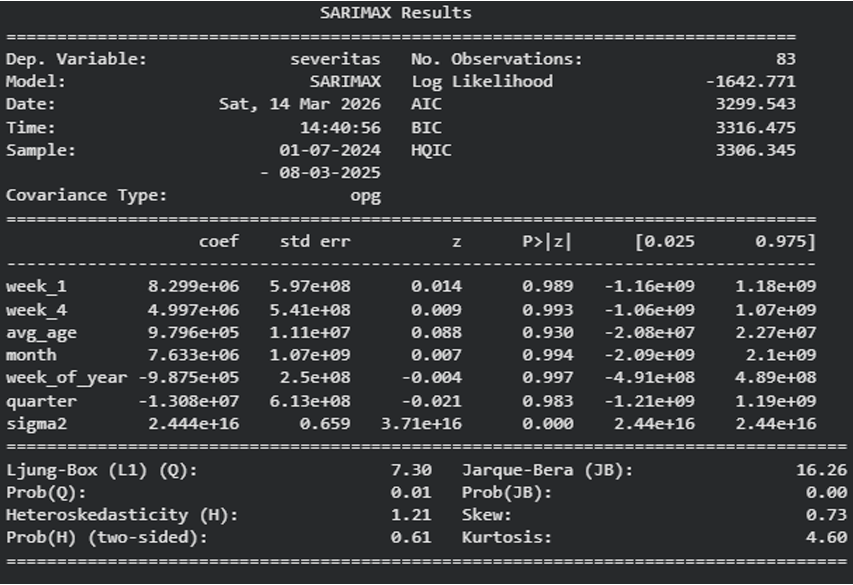
  - SARIMAX (0,0,1) (Frequency)
  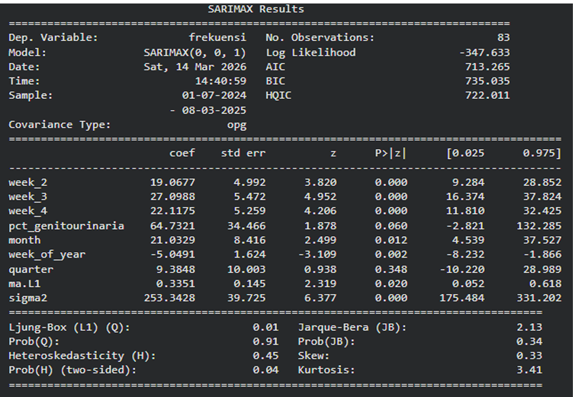
  - SARIMAX (1,0,1) (Severity)
  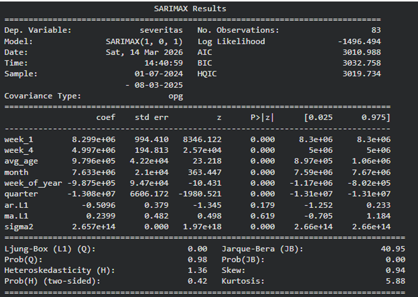
  - RandomForest
  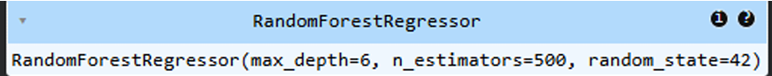
  - LightGBM
  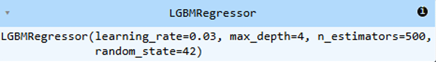

## Evaluation
The training results of several models, SARIMAX with parameters (0.0.0) and LightBM, obtained the lowest MAPE scores among the others, namely SARIMAX 9.9% and LightBM 8.8% in predicting the August-December 2026 period.

## Conclusion
- Identifying Factors Influencing Claims and Severity

Based on the modeling, factors influencing claim frequency and severity can be distinguished based on the exogenous variables used.
For claim frequency, influential variables include week of the month (week 2, week 3, week 4), which indicates a pattern of claim variation within a single monthly period. Furthermore, health factors such as the percentage of genitourinary disease cases contribute to the increase in the number of claims. Time variables such as month, quarter, and week of year are also used to capture seasonal patterns and long-term trends.

Meanwhile, for claim severity, the main influencing factor is participant characteristics, particularly average age (avg_age), which is related to risk level and treatment costs. Furthermore, week of the month (week 1 and week 4), as well as seasonal variables (month, quarter), and time trends (week of year) also contribute to explaining variations in claim costs.

Overall, claim frequency is more influenced by temporal factors and disease type, while claim severity is more influenced by participant characteristics, while still considering seasonal patterns and time trends.

- Recommendations for Claims Risk Management Initiatives

Based on the identified factors, several strategies can be implemented to control claims risk and maintain premium stability.
From a risk selection perspective, the influence of age on claim severity demonstrates the importance of segmenting participants based on risk profile. Companies can implement age-based portfolio management and strengthen the underwriting process for participants with high health risks.

From a preventive strategy perspective, the influence of genitourinary diseases on claim frequency indicates the need for more targeted health programs, such as education, regular check-ups, and healthy lifestyle promotion to reduce potential claims.
Furthermore, the pattern of increased claims in the third week can be used as a basis for improved operational monitoring, so companies can be better prepared for potential spikes in claims.

From an early detection perspective, the use of time-series predictive models such as SARIMAX can help project increases in claims. This allows companies to implement early mitigation measures, such as claims audits, increased healthcare monitoring, and interventions for high-risk groups.
Overall, a combination of risk selection, prevention, and predictive analytics strategies can help control claims growth and keep premiums competitive and affordable.

